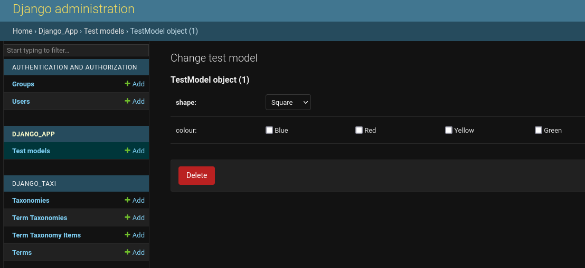

# Overview
Django-Taxi allows creating taxonomies and terms related with django models through generic relations and stored
separately only in `django_taxi` models and provide fields and mixins to create django forms that manage choices.

Loosely inspired by Wordpress taxonomies.

# Install & Configure

    pip install django-taxi

Add app to installed apps in settings.

    INSTALLED_APPS = [
        # ...
        "django_taxi",
        # ...
    ]

Run `./manage.py migrate` that create 4 new tables in the database.

# Example

The example uses a model `TestModel` in app `django_app` where we related the taxi terms using the field named `terms`.
We created a form that required that one shape is given and allow one or multiple colours set on the model instance.
The form may be used as a regular `ModelForm` and also works fine in admin.

## django_app/models.py

    from django.db import models
    from django_taxi.fields import TaxiRelation

    class TestModel(models.Model):
        terms = TaxiRelation()  # Inherit from GenericRelation

## django_app/forms.py

    from django import forms

    from django_taxi.fields import TaxiField, TaxiSingleField
    from django_taxi.mixins import TaxiModelMixin
    from .models import TestModel

    class MyAdminForm(TaxiModelMixin, forms.ModelForm):
        shape = TaxiSingleField(label="Shape", taxonomy_slug="shape", required=True)
        colour = TaxiField(label="Colour", taxonomy_slug="colour", required=False)

        class Meta:
            model = TestModel
            fields = ("shape", "colour")

## Populate django-taxi data

To start using Django-taxi some taxonomies, terms and relation between them should be created using the django admin or through code as below.

    from django_taxi.models import Taxonomy, Term, TermTaxonomy, TermTaxonomyItem

    shape_taxi = Taxonomy(name="Shape", slug="shape")
    colour_taxi = Taxonomy(name="Colour")  # Omitted slugs is slugified from name on save.

    shape_taxi.save()
    colour_taxi.save()

    for shape in ["Square", "Circle", "Triangle"]:
        shape_term = Term(name=shape)
        shape_term.save()
        TermTaxonomy(term=shape_term, taxonomy=shape_taxi).save()

    for colour in ["Blue", "Red", "Yellow", "Green"]:
        colour_term = Term(name=colour)
        colour_term.save()
        TermTaxonomy(term=colour_term, taxonomy=colour_taxi).save()

## Result

### Django admin

### Template

    
        
{{ t }}

    

### Multiple code methods

Get all available terms on an instance `obj`.

    all_terms = obj.terms.all()

Get terms for a specific taxonomy.

    colours = obj.terms.taxonomy_slug("colour")
    shapes = obj.terms.filter(term_taxonomy__taxonomy__slug="shape")

Example of getting terms the other way around through TermTaxonomyItem.

    shapes = TermTaxonomyItem.objects.filter(
        content_type__app_label="django_app",
        content_type__model="testmodel",
        object_id=1,
        term_taxonomy__taxonomy__slug="shape"
    )

# Alternatives

Django-taxi is in the middle of several other use cases where other methods might be better suited. Django-taxi is however a 300 line of code project and thus probably lacking a lot of features that might be available in the alternatives.

## Standard django field with choices

Using only django tools that `taxonomy` may be defined as a field and `terms` in the fields `choices`. Django-taxi might be better suited if the model should be kept generic and specific taxonomies is better suited to be defined on form levels, or if choices simple and dynamically may be added, the sole reason this projected was created.

## Django-Taxonomy

Allows a much more detailed taxonomy term management using django models. A different use case where Django-Taxi taxonomies and terms are only strings.

## Django-Taggit

A much more generic tags library. I'm sure one could extend django-taggit to get similar functionality as Django-taxi.
